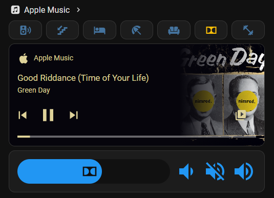

# Apple Music for Home Assistant

[](https://github.com/hacs/integration)
[](https://github.com/Hackashaq666/apple-music-hacs/releases)
[](LICENSE)

Control Apple Music on macOS from Home Assistant — with native media browser, AirPlay device control, album art, real-time playback progress, and **instant push updates** via macOS distributed notifications.

---

## Screenshots



---

## Credits

The Mac server is based on [itunes-api](https://github.com/maddox/itunes-api) by [Jon Maddox](https://github.com/maddox), with further updates by [chasut](https://github.com/chasut/itunes-api) for compatibility with the modern Apple Music app. This project extends that work with progress tracking, library browsing, instant push notifications, and a modernized install process.

---

## Overview

This integration has two parts:

1. **A REST API server** that runs on your Mac and exposes the Apple Music app over HTTP
2. **A Home Assistant custom integration** that connects to that server

State updates use **Server-Sent Events (SSE)** driven by macOS distributed notifications — track changes and play/pause reflect in HA instantly with no polling delay.

---

## Features

- Play, pause, stop, next, previous, seek
- Volume and mute control
- Shuffle and repeat modes
- Real-time playback progress bar
- Album art (updates per track)
- AirPlay device selection and per-device volume control
- Native HA media browser — browse Playlists, Artists, and Albums
- **Instant track change and play/pause updates** via macOS distributed notifications and SSE
- Config flow UI setup — no YAML required

---

## Requirements

**Mac:**
- macOS 12 or later
- Node.js 18 or later
- Python 3.10 or later (for the notification listener)
- Apple Music app

**Home Assistant:**
- Home Assistant 2024.1 or later
- HACS (for easy install)

---

## Part 1 — Mac Server Setup

The server runs on your Mac and gives Home Assistant a local REST API to control the Music app.

### Install

```bash
git clone https://github.com/Hackashaq666/apple-music-hacs.git
cd apple-music-hacs/server
npm install
npm run install-service
```

This installs two background services that auto-start at login:

- **apple-music-api** — the REST API server on port `8181`
- **apple-music-notify** — a lightweight Python listener that receives macOS Music app notifications and pushes instant state changes to HA via SSE

### Notification listener setup

The notification listener requires `pyobjc`. Install it once with your system Python 3:

```bash
python3 -m ensurepip
python3 -m pip install pyobjc-framework-Cocoa
```

> **Note:** Use Python 3.10 or later. The macOS system Python (3.9) is not supported — use [MacPorts](https://www.macports.org) or [Homebrew](https://brew.sh) to install a newer version if needed.

### Verify

```bash
curl http://localhost:8181/now_playing
curl http://localhost:8181/_ping
```

Or open `http://localhost:8181` in your browser.

### Dev mode

To run the server in the foreground with console logging:

```bash
npm run dev
```

### Uninstall

```bash
npm run uninstall-service
```

### Server API

The server exposes a local HTTP API on port `8181`. Key endpoints:

| Method | Endpoint | Description |
|---|---|---|
| GET | `/now_playing` | Current player state with progress |
| GET | `/artwork` | Current track album art (JPEG) |
| PUT | `/play` | Play |
| PUT | `/pause` | Pause |
| PUT | `/next` | Next track |
| PUT | `/previous` | Previous track |
| PUT | `/seek` | Seek to position (body: `position=90.5`) |
| PUT | `/volume` | Set volume (body: `level=60`) |
| PUT | `/shuffle` | Set shuffle (body: `mode=songs\|off`) |
| PUT | `/repeat` | Set repeat (body: `mode=all\|one\|off`) |
| GET | `/playlists` | List playlists |
| PUT | `/playlists/:id/play` | Play a playlist |
| GET | `/library/artists` | Browse artists |
| GET | `/library/albums` | Browse albums |
| GET | `/library/albums/:artist/:album/tracks` | Tracks in an album |
| PUT | `/library/tracks/:id/play` | Play a track by ID |
| GET | `/library/search?q=query` | Search tracks |
| GET | `/airplay_devices` | List AirPlay devices |
| PUT | `/airplay_devices/:id/on` | Enable AirPlay device |
| PUT | `/airplay_devices/:id/off` | Disable AirPlay device |
| PUT | `/airplay_devices/:id/volume` | Set AirPlay device volume |
| GET | `/events` | SSE stream for instant push updates |
| POST | `/notify` | Receive macOS Music app notifications (used internally by notify.py) |

---

## Part 2 — Home Assistant Integration

### Install via HACS

1. In HACS, go to **Integrations**
2. Click the three-dot menu → **Custom repositories**
3. Add `https://github.com/Hackashaq666/apple-music-hacs` as an **Integration**
4. Search for **Apple Music** in HACS and install it
5. Restart Home Assistant

### Manual install

Copy the `custom_components/apple_music/` folder into your HA `config/custom_components/` directory and restart Home Assistant.

### Setup

1. Go to **Settings → Integrations → Add Integration**
2. Search for **Apple Music**
3. Enter your Mac's IP address and port (`8181`)
4. Click **Submit**

Home Assistant will discover your Apple Music player and all AirPlay devices automatically.

---

## Entities

| Entity | Type | Description |
|---|---|---|
| `media_player.apple_music` | Media Player | Main Apple Music player |
| `media_player.<airplay_device>` | Media Player | One per AirPlay device |

### Media Browser

The integration supports HA's native media browser. Navigate to:

- **Playlists** — play any playlist
- **Artists** → Albums → Tracks
- **Albums** → Tracks

The library cache warms automatically when the server starts and refreshes every 30 minutes in the background.

---

## How push updates work

```
Music app → macOS distributed notification
         → notify.py (POST /notify)
         → server SSE broadcast (/events)
         → Home Assistant (instant state update)
```

Track changes and play/pause reflect in HA in under a second. Playback position and AirPlay device state sync every 30 seconds via background poll.

---

## Notes

- The server must be running on your Mac for the integration to work
- Apple Music must be open (it launches automatically when the server starts a track)
- Track changes and play/pause are pushed instantly — no polling delay
- AirPlay device state and playback position sync every 30 seconds
- The library cache refreshes every 30 minutes and stays valid for 60 minutes
- Album art is served from the local Mac and is not externally accessible

---

## Troubleshooting

**Integration shows unavailable**
- Check the server is running: `curl http://<mac-ip>:8181/_ping`
- Check the Mac firewall allows connections on port 8181

**State not updating instantly**
- Check the notify service is running: `cat ~/apple-music-api/log/notify.log`
- Make sure `pyobjc-framework-Cocoa` is installed for the correct Python version

**Media browser is slow on first open**
- The library cache is still warming on startup. Wait 30–60 seconds after the server starts. After that it stays warm indefinitely via background refresh.

**Artwork not updating**
- Make sure you are running the latest version of both the server and the integration

**AirPlay devices not appearing**
- Reload the integration: Settings → Integrations → Apple Music → Reload

---

## Contributing

1. Fork the repo
2. Create a feature branch
3. Open a pull request

---

## License

MIT
